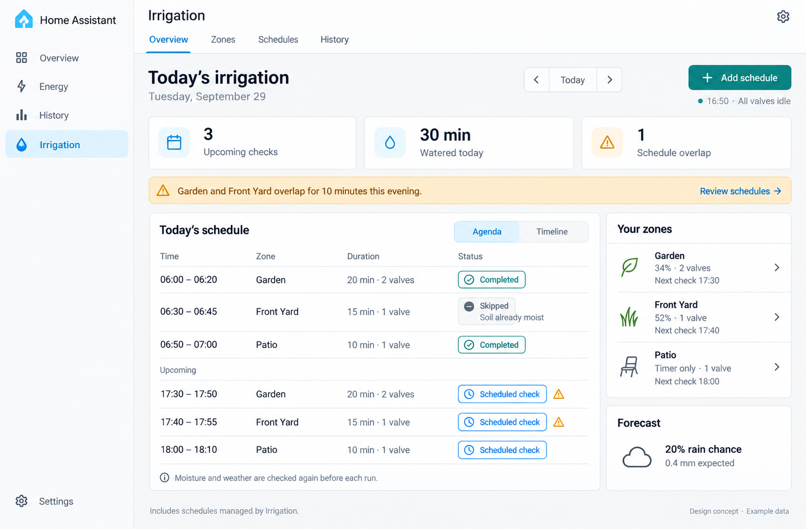
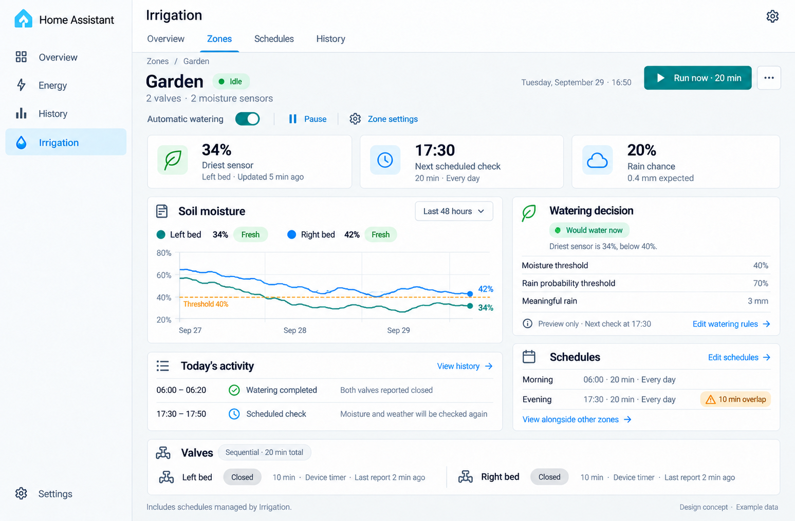
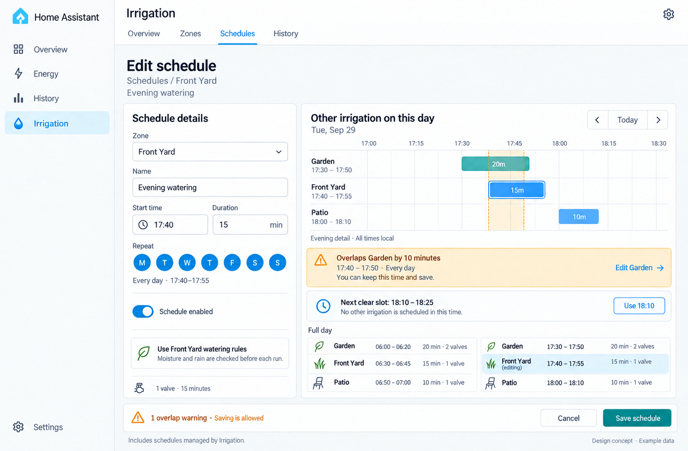

# Irrigation UI concepts — v1

Created 2026-09-28 for review against the
[requirements draft](../IRRIGATION_APP_REQUIREMENTS.md).

These are proposed interfaces generated with the built-in image-generation tool,
using example data. They are not screenshots of an implemented integration.
The [prompt set](v1/prompts.md) preserves the design instructions for iteration.
This gallery records design intent; the [project roadmap](../../PROJECT_ROADMAP.md)
remains the live status checklist.

## Visual direction

A light Home Assistant-style shell with familiar sidebar navigation, cyan
selection, teal watering actions, white panels, and restrained amber warnings.
The app has Overview, Zones, Schedules, and History tabs. The three concepts
share the same example household and day so their behavior can be compared.

The images explore layout and information hierarchy. Their sample thresholds,
forecasts, and readings are not imported household settings. Time labels express
the intended schedule; timeline pixels are illustrative rather than a validated
scheduling calculation. Detailed execution policy remains in the requirements.

## 1. Daily overview

[Open full-size overview](v1/01-daily-overview.png)

The initial view emphasizes the day's agenda. Completed, skipped, and upcoming
checks stay in one chronological list. Upcoming checks remain conditional on
moisture and weather. The overlap warning links into scheduling, while zone
summaries provide direct navigation into each dashboard. The Timeline control
indicates an alternate overview view; that alternate view is not illustrated
in this set.

Requirements represented: U-06, DAY-01 through DAY-04, and HIST-01.

## 2. Garden zone dashboard

[Open full-size zone dashboard](v1/02-zone-dashboard.png)

The page prioritizes the current moisture reading, the next scheduled check,
and the explanation behind the watering decision. Both sensor readings and
their threshold are visible in the trend chart. Manual Run Now is prominent,
while valve details show that two ten-minute operations produce a twenty-minute
zone run. The example is idle; an active-run version would replace the relevant
controls with progress and Stop.

Requirements represented: U-01, INPUT-01, DEC-01, RUN-01, VIEW-01, and HIST-02.

## 3. Schedule editor with advisory overlap

[Open full-size schedule editor](v1/03-schedule-editor.png)

The form and schedule context sit side by side. The evening chart gives enough
detail to compare short runs; the full-day list keeps the other occurrences
visible. The edited Front Yard schedule overlaps Garden by ten minutes.
The warning explicitly permits saving, and Save schedule stays enabled.

The optional next clear slot is **18:10–18:25**. Although Garden finishes at
17:50, a fifteen-minute Front Yard run at 17:50 would overlap Patio at 18:00.
Selecting Use 18:10 is an explicit user action; the editor does not move the
schedule automatically. These examples assume no added handoff allowance.

Requirements represented: U-07, U-08, SCH-01 through SCH-07, and A-03.

## Shared example data

The example date is Tuesday, September 29, 2026, at 16:50 local time.

| Zone | Morning | Evening | Equipment |
| --- | --- | --- | --- |
| Garden | 06:00–06:20, completed | 17:30–17:50, scheduled check | Two valves, ten minutes each, sequential; two moisture sensors. |
| Front Yard | 06:30–06:45, skipped for moisture | 17:40–17:55, scheduled check | One valve; moisture-based decision. |
| Patio | 06:50–07:00, completed | 18:00–18:10, scheduled check | One valve; timer only. |

This produces three upcoming checks, thirty minutes of completed zone watering,
and one ten-minute evening overlap. Garden and Front Yard use independent
eligible controllers in this example, so the planned overlap does not itself
require queueing.

## Review focus

The first design review should focus on the overview's information density,
the balance between the schedule form and the surrounding timeline, and the
zone dashboard's priority between moisture, decisions, schedules, and controls.
Mobile, new-zone setup, active watering, stale inputs, and partial-failure
states are not illustrated by these three desktop concepts. Their requirements
remain in the product draft.
